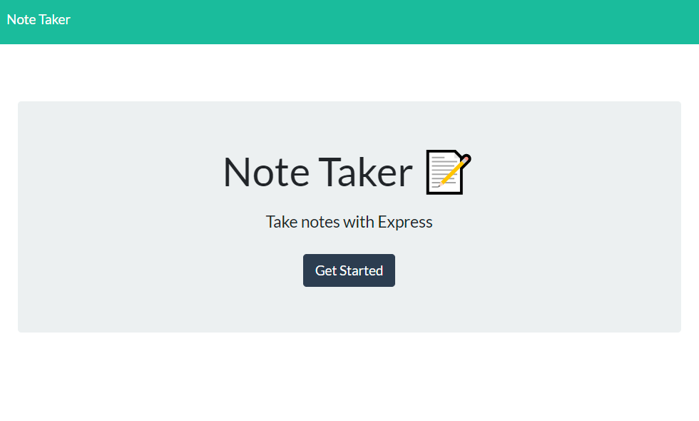
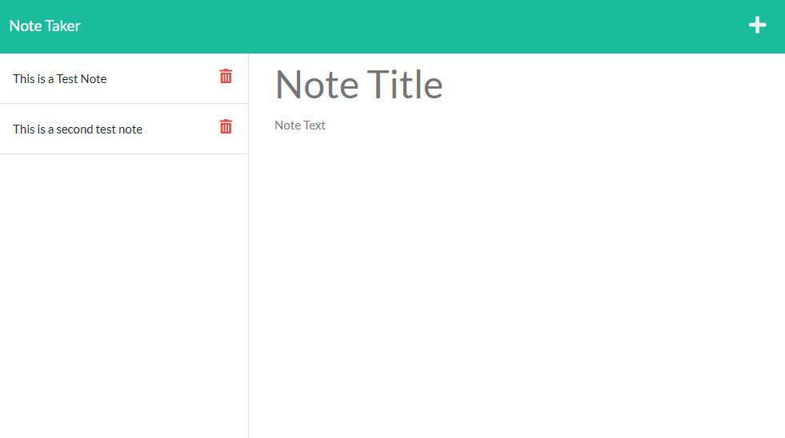

# note-taker

## Description

A web app to write and save notes remotely. Using Express (a 'Fast, unopinionated, minimalist web framework for Node.js' used to establish a remote server) and Heroku, this web app has been deployed to allow users to create and save notes from anywhere.

Just visit the deployment to start saving notes!

## Link

[Link to deployment on Heroku]( https://secure-mesa-30607.herokuapp.com/)

## Screenshots

## Features

### Remote Storage

Notes are stored and retrieved remotely, allowing for secure off-site storage. Saved notes are transmitted and saved on the remote server.

### Create and Delete with Ease

Quick access buttons to create new notes and delete new notes are always present. Just click the plus sign to start on a new note, or, in the list, click on the trash icon to trash old notes.

### Access From Anywhere

Access the URL from any computer and browser and find your notes present. The tool is platform and browser agnostic.

## Tech Stack

* HTML5
* CSS3
* Express
* Heroku
* UUID
